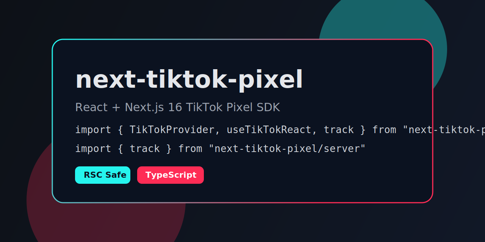
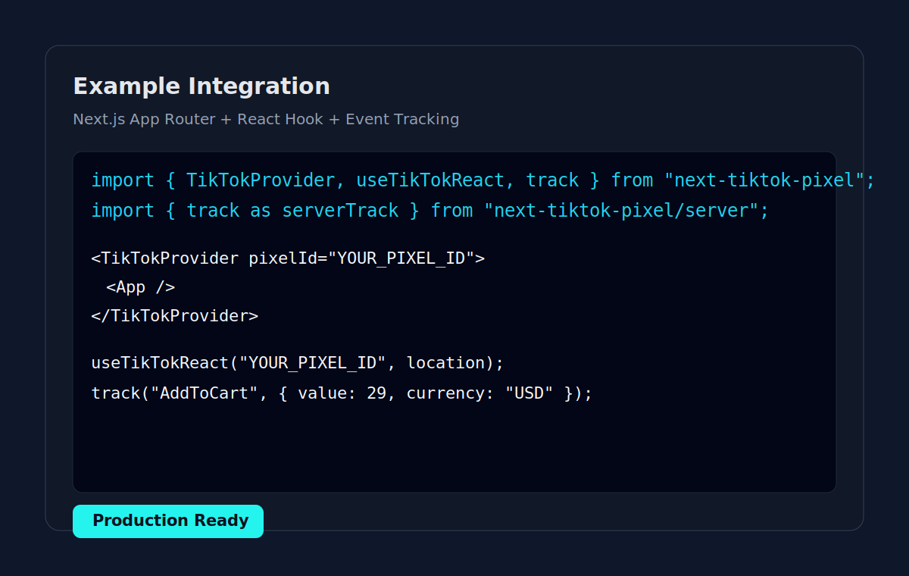

# tiktok-pixel



TikTok Pixel SDK for React and Next.js App Router.

Type-safe API, ESM + CJS build, and Next.js 16-compatible client boundaries.

## Demo



## Features

- React + Next.js 15/16 support
- Client-first root API
- Optional server subpath export
- Strong TypeScript types
- ESM + CJS outputs with source maps
- `tsup` build with declaration files

## Install

```bash
npm install tiktok-pixel
```

## Imports

```ts
import { TikTokProvider, useTikTokReact, track } from "tiktok-pixel";
```

Optional server import:

```ts
import { track } from "tiktok-pixel/server";
```

## Next.js App Router Example

`app/providers.tsx`

```tsx
"use client";

import { TikTokProvider } from "tiktok-pixel";

export default function Providers({ children }: { children: React.ReactNode }) {
  return <TikTokProvider pixelId="YOUR_PIXEL_ID">{children}</TikTokProvider>;
}
```

`app/layout.tsx`

```tsx
import Providers from "./providers";

export default function RootLayout({ children }: { children: React.ReactNode }) {
  return (
    <html lang="en">
      <body>
        <Providers>{children}</Providers>
      </body>
    </html>
  );
}
```

## React SPA Example

```tsx
import { useLocation } from "react-router-dom";
import { useTikTokReact, track } from "tiktok-pixel";

export default function App() {
  const location = useLocation();
  useTikTokReact("YOUR_PIXEL_ID", location, false);

  return (
    <button onClick={() => track("AddToCart", { value: 29, currency: "USD" })}>
      Track AddToCart
    </button>
  );
}
```

## API

### `TikTokProvider`

Props:

- `pixelId: string` (required)
- `debug?: boolean`
- `children: ReactNode`

### `useTikTokReact(pixelId, location?, debug?)`

- `pixelId: string`
- `location?: unknown` (pass router location in SPA)
- `debug?: boolean`

### `track(event, data?)`

- `event: TikTokEvent`
- `data?: TikTokEventData`

Supported events:

- `AddToCart`
- `CompletePayment`
- `InitiateCheckout`
- `ViewContent`
- `SubmitForm`
- `Search`
- `Contact`
- `CompleteRegistration`
- `Subscribe`

## Build

```bash
npm run build
```

## Publish Checklist

```bash
npm run build
npm pack --dry-run
npm publish
```

## Package Details

- Package name: `tiktok-pixel`
- License: MIT
- Public package: yes
- Peer dependencies: `react`, `react-dom`, `next`

## License

MIT
